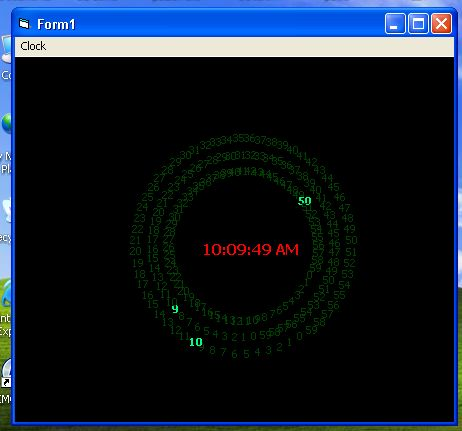



## Awsome clock display

### Description

Uses Sine and Cosine functions to display a rotating clock display, ive never seen it done before and thought maybe i should do it. Some configuration options are in there too. Enjoy!
 
### More Info
 

             |
---                |---
**Submitted On**   |2003-05-29 10:08:38
**By**             |[N/A](https://github.com/Planet-Source-Code/PSCIndex/blob/master/ByAuthor/empty.md)
**Level**          |Advanced
**User Rating**    |4.2 (21 globes from 5 users)
**Compatibility**  |VB 6\.0
**Category**       |[Graphics](https://github.com/Planet-Source-Code/PSCIndex/blob/master/ByCategory/graphics__1-46.md)
**World**          |[Visual Basic](https://github.com/Planet-Source-Code/PSCIndex/blob/master/ByWorld/visual-basic.md)
**Archive File**   |[Awsome\_clo1593715292003\.zip](https://github.com/Planet-Source-Code/awsome-clock-display__1-45793/archive/master.zip)

